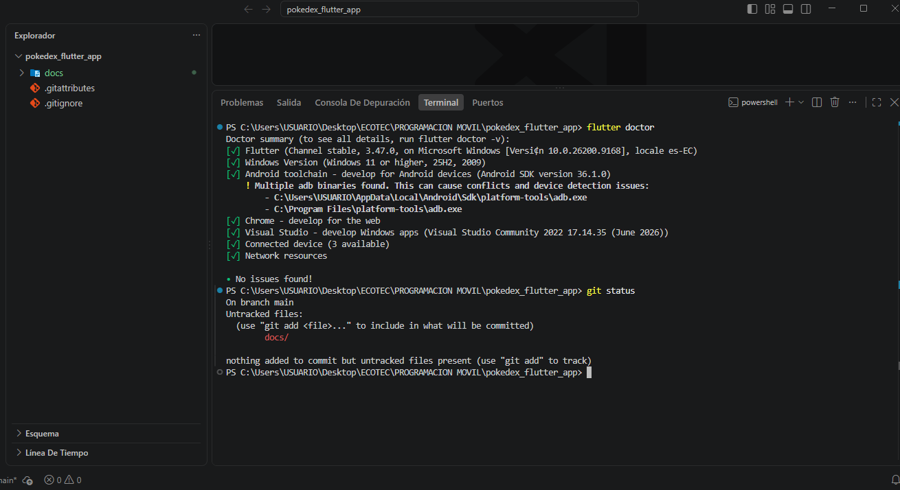
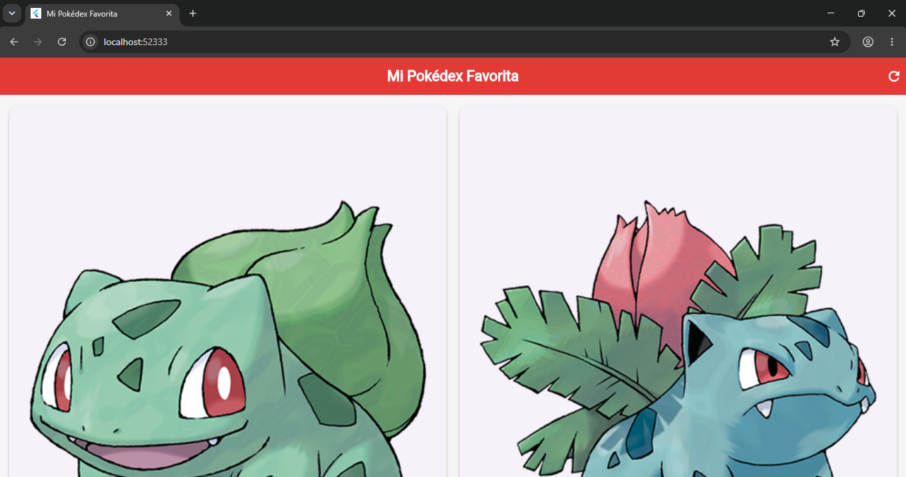
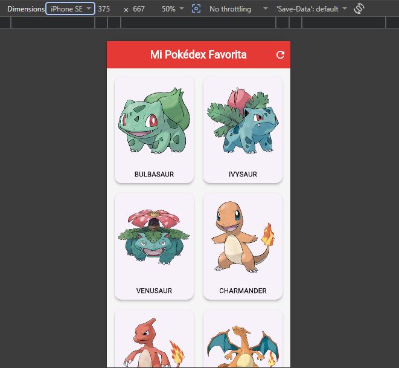
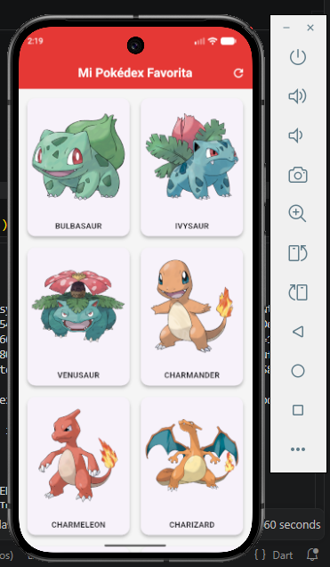
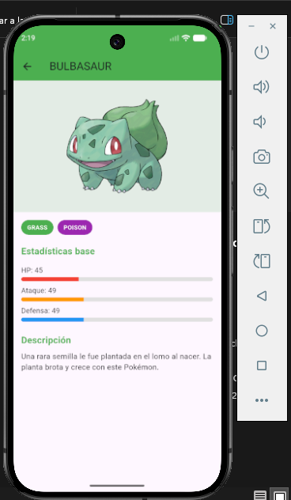
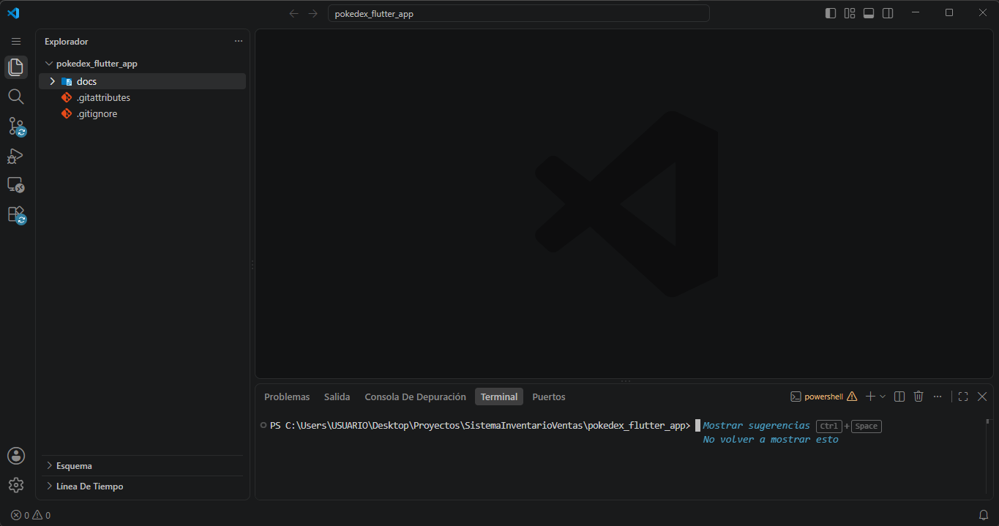
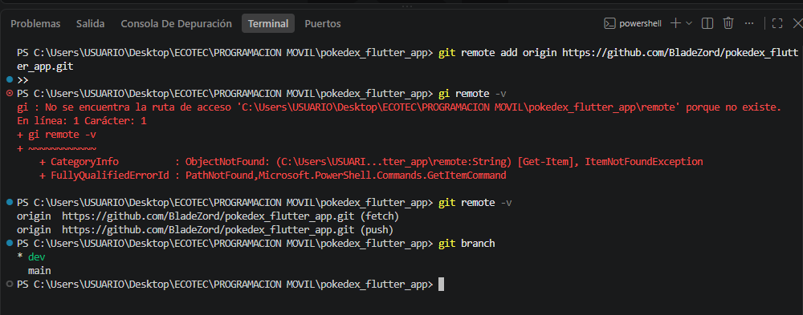

# Mi Primera Aplicación en Flutter - Pokédex

## Descripción

Este proyecto consiste en una aplicación móvil desarrollada con **Flutter** llamada **Pokédex**.

La aplicación permite consultar información de diferentes Pokémon obtenidos desde una API pública externa. En la pantalla principal se muestra una lista de Pokémon con su imagen, nombre y tipo. Al seleccionar uno de ellos, el usuario puede acceder a una pantalla de detalle donde se muestra información adicional como sus estadísticas y descripción.

---

# Objetivo

Desarrollar una aplicación básica utilizando Flutter que permita aplicar los conocimientos iniciales relacionados con:

* Creación de un proyecto Flutter.
* Uso de widgets básicos.
* Construcción de interfaces utilizando Material Design.
* Uso de `MaterialApp`, `Scaffold` y `AppBar`.
* Organización del código en archivos y carpetas.
* Consumo de información desde una API externa.
* Instalación y utilización de un paquete externo.
* Ejecución de la aplicación en un navegador y emulador Android.
* Uso de Git y GitHub para el control de versiones.

---

# Tema de la aplicación

El tema seleccionado para la aplicación es una **Pokédex**.

La aplicación permite visualizar información de diferentes Pokémon y consultar sus características principales.

Entre las funcionalidades implementadas se encuentran:

* Visualización de una lista de Pokémon.
* Consulta de imágenes.
* Visualización de tipos.
* Acceso a una pantalla de detalle.
* Visualización de estadísticas.
* Visualización de información adicional.
* Botón para volver a cargar la información.
* Consumo de datos desde una API externa.

---

# Tecnologías utilizadas

El proyecto fue desarrollado utilizando las siguientes tecnologías:

* Flutter.
* Dart.
* Material Design.
* Git.
* GitHub.
* Android Emulator.
* Visual Studio Code.

---

# Creación del proyecto

El proyecto fue creado utilizando Flutter.

Un proyecto Flutter puede crearse desde la terminal utilizando el siguiente comando:

```bash
flutter create pokedex_flutter_app
```

Posteriormente se puede acceder al directorio del proyecto:

```bash
cd pokedex_flutter_app
```

Para ejecutar la aplicación:

```bash
flutter run
```

---

# Verificación de la instalación de Flutter

Antes de comenzar el desarrollo se verificó la instalación y configuración del entorno mediante el comando:

```bash
flutter doctor
```

Este comando permite comprobar que las herramientas necesarias para desarrollar aplicaciones Flutter se encuentren correctamente instaladas y configuradas.

La evidencia de esta verificación se encuentra en la carpeta `docs`.

## Evidencia



---

# Ejecución del proyecto

El proyecto fue ejecutado inicialmente desde Visual Studio Code.

También se realizaron pruebas en:

* Navegador web.
* Vista móvil.
* Emulador Android.

## Ejecución inicial en navegador



## Vista móvil en navegador



## Ejecución en emulador Android



---

# Estructura del proyecto

La aplicación se encuentra organizada en diferentes carpetas según la responsabilidad de cada archivo.

```text
lib/
├── main.dart
├── models/
│   └── pokemon_model.dart
├── screens/
│   ├── home_screen.dart
│   └── pokemon_detail_screen.dart
└── services/
    └── pokemon_service.dart
```

## `main.dart`

Es el punto de entrada de la aplicación.

En este archivo se configura la aplicación utilizando `MaterialApp` y se establece la pantalla principal.

Entre sus principales responsabilidades se encuentran:

* Inicializar la aplicación.
* Configurar el tema.
* Definir el título.
* Establecer la pantalla inicial.

---

## `models/pokemon_model.dart`

Contiene el modelo utilizado para representar la información de un Pokémon.

El modelo permite organizar los datos obtenidos desde la API, como:

* Nombre.
* Imagen.
* Tipos.
* Estadísticas.
* Descripción.
* Información adicional.

La utilización de un modelo permite separar la estructura de los datos de la interfaz gráfica.

---

## `services/pokemon_service.dart`

Este archivo contiene la lógica encargada de realizar las solicitudes a la API externa.

Su responsabilidad principal es:

* Realizar solicitudes HTTP.
* Obtener la información de los Pokémon.
* Procesar las respuestas recibidas.
* Convertir los datos obtenidos en objetos de tipo `PokemonModel`.

---

## `screens/home_screen.dart`

Contiene la pantalla principal de la aplicación.

En esta pantalla se muestra una lista de Pokémon obtenidos desde el servicio.

La pantalla incluye:

* `Scaffold`.
* `AppBar`.
* Título de la aplicación.
* Indicador de carga.
* Lista de Pokémon.
* Tarjetas con información.
* Imágenes.
* Tipos de Pokémon.
* Botón para actualizar la información.
* Navegación hacia la pantalla de detalle.

---

## `screens/pokemon_detail_screen.dart`

Contiene la pantalla encargada de mostrar información detallada de un Pokémon seleccionado.

Entre la información mostrada se encuentran:

* Imagen.
* Nombre.
* Tipos.
* Estadísticas.
* Información descriptiva.

## Evidencia



---

# Widgets utilizados

Durante el desarrollo de la aplicación se utilizaron diferentes widgets proporcionados por Flutter.

## MaterialApp

Se utiliza para configurar la aplicación utilizando Material Design.

Permite establecer elementos como:

* Tema.
* Título.
* Pantalla inicial.

---

## Scaffold

Se utiliza como estructura principal de las pantallas.

Permite organizar elementos como:

* `AppBar`.
* Contenido principal.
* Botones flotantes u otros componentes.

---

## AppBar

Se utiliza para mostrar la barra superior de las pantallas.

En la aplicación permite identificar la pantalla que se encuentra utilizando el usuario.

---

## Column

Se utiliza para organizar diferentes widgets de forma vertical.

Es utilizado para estructurar la información mostrada en las pantallas.

---

## Row

Se utiliza para organizar widgets horizontalmente.

Por ejemplo, puede utilizarse para mostrar los tipos asociados a un Pokémon.

---

## Container

Se utiliza para aplicar estilos y organizar elementos.

Permite trabajar con propiedades como:

* Espaciado.
* Márgenes.
* Colores.
* Bordes.
* Tamaños.

---

## Card

Se utiliza para presentar la información de los Pokémon dentro de una tarjeta.

Cada tarjeta permite mostrar información resumida antes de acceder a la pantalla de detalle.

---

## Text

Se utiliza para mostrar información dentro de la aplicación.

Entre los textos mostrados se encuentran:

* Nombre de la aplicación.
* Nombre del Pokémon.
* Tipos.
* Estadísticas.
* Información adicional.

---

## Image

La aplicación muestra imágenes de los Pokémon obtenidas a partir de la información proporcionada por la API.

---

# Colores personalizados

La aplicación utiliza colores para mejorar la presentación visual de la información.

Los colores pueden variar según las características o tipos de los Pokémon mostrados.

Esto permite diferenciar visualmente elementos de la interfaz y mejorar la experiencia del usuario.

---

# Interacción básica

La aplicación incluye diferentes interacciones.

Una de ellas es el botón utilizado para actualizar o volver a cargar la información de los Pokémon.

Al ejecutar esta acción, la aplicación realiza nuevamente la solicitud al servicio y actualiza la información mostrada.

También se implementó interacción mediante las tarjetas de los Pokémon.

Al seleccionar un Pokémon, el usuario es dirigido a una pantalla donde puede consultar información detallada.

De esta manera, la aplicación incluye una interacción básica que permite modificar el contenido mostrado sin necesidad de cerrar o reiniciar la aplicación.

---

# Navegación

La aplicación cuenta con navegación entre pantallas.

El flujo principal es el siguiente:

```text
Pantalla principal
        │
        ▼
Lista de Pokémon
        │
        ▼
Seleccionar Pokémon
        │
        ▼
Pantalla de detalle
```

El usuario puede seleccionar un Pokémon desde la pantalla principal para acceder a su información detallada.

---

# Consumo de API

La información utilizada por la aplicación se obtiene desde **PokéAPI**.

PokéAPI proporciona información relacionada con el universo Pokémon, incluyendo datos como:

* Nombre.
* Tipos.
* Estadísticas.
* Características.
* Imágenes.

La aplicación realiza solicitudes a la API y procesa la información recibida para mostrarla dentro de la interfaz.

---

# Paquete externo utilizado

Para realizar las solicitudes a la API se utiliza el paquete externo:

```text
http
```

Este paquete permite realizar solicitudes HTTP desde una aplicación Flutter.

La dependencia se encuentra registrada dentro del archivo:

```text
pubspec.yaml
```

Ejemplo:

```yaml
dependencies:
  flutter:
    sdk: flutter

  http: ^1.2.2
```

El paquete es utilizado dentro del servicio de Pokémon para realizar las solicitudes necesarias y obtener la información desde la API externa.

Para instalar las dependencias del proyecto se puede utilizar el comando:

```bash
flutter pub get
```

---

# Archivo pubspec.yaml

El archivo `pubspec.yaml` permite administrar las dependencias utilizadas por el proyecto.

Entre las dependencias utilizadas se encuentra el paquete `http`, necesario para realizar la comunicación con la API.

Flutter descarga las dependencias configuradas mediante:

```bash
flutter pub get
```

---

# Evidencias del proyecto

La carpeta `docs` contiene diferentes capturas relacionadas con el proceso de desarrollo.

Actualmente incluye evidencias relacionadas con:

## Creación del workspace



## Verificación de Flutter


## Configuración del repositorio



## Ejecución inicial


## Pantalla de detalle


---

# Control de versiones

El proyecto utiliza Git para el control de versiones.

El código fuente fue publicado en un repositorio público de GitHub.

Durante el desarrollo se realizaron diferentes commits que permiten mantener un historial de los cambios realizados.

El proyecto cumple con el requisito de contar con un mínimo de cuatro commits.

---
# Declaración de uso de IA

Este proyecto ha sido desarrollado con asistencia de herramientas de **inteligencia artificial (IA)** para tareas puntuales de corrección, optimización de código existente, creación de widgets reutilizables, documentación y revisión.

La arquitectura de la aplicación, las decisiones de diseño y los requisitos funcionales implementados son responsabilidad del autor del proyecto.

---
# Repositorio

El código fuente completo se encuentra publicado en el repositorio público:

**BladeZord/pokedex_flutter_app**

El repositorio incluye:

* Código fuente de Flutter.
* Configuración del proyecto.
* Archivo `pubspec.yaml`.
* Documentación.
* Capturas y evidencias.
* Historial de commits.

---

# Cómo ejecutar el proyecto

## 1. Clonar el repositorio

Clonar el repositorio desde GitHub utilizando Git.

## 2. Acceder al proyecto

```bash
cd pokedex_flutter_app
```

## 3. Instalar las dependencias

```bash
flutter pub get
```

## 4. Verificar los dispositivos disponibles

```bash
flutter devices
```

## 5. Ejecutar la aplicación

```bash
flutter run
```

La aplicación puede ejecutarse en un dispositivo físico, emulador Android o, dependiendo de la configuración del entorno, en otras plataformas compatibles con Flutter.

---

# Autor

**Nombre completo del estudiante:** Kevin Quito

---

# Referencias

Las siguientes fuentes fueron utilizadas como referencia durante el desarrollo del proyecto:

* Flutter Documentation.
* Dart Documentation.
* Pub.dev.
* Documentación del paquete `http`.
* PokéAPI Documentation.
* GitHub Documentation.

Estas fuentes fueron utilizadas como apoyo para la creación del proyecto, implementación de widgets, consumo de servicios HTTP y publicación del código mediante GitHub.
